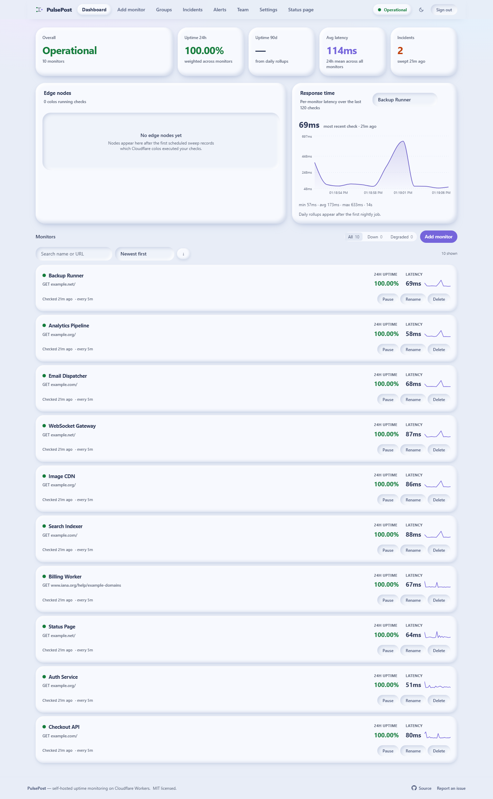
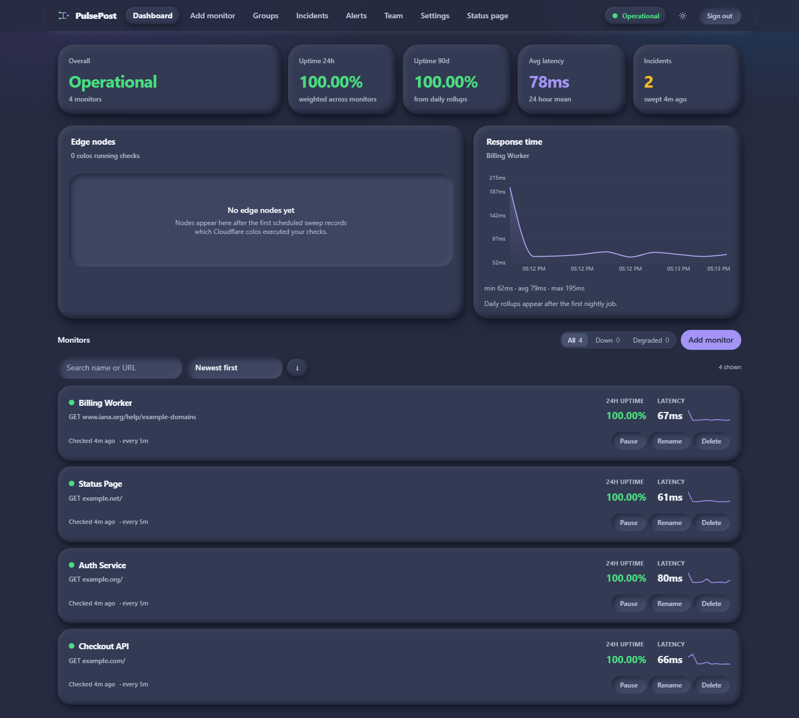
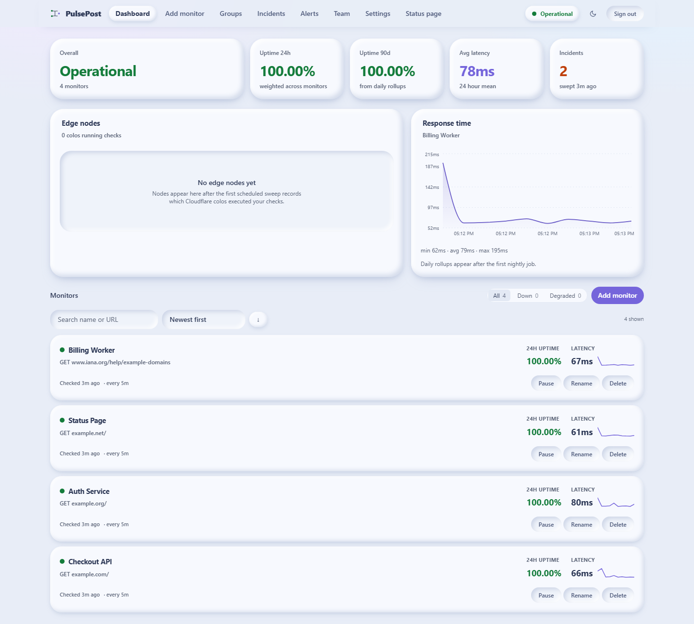
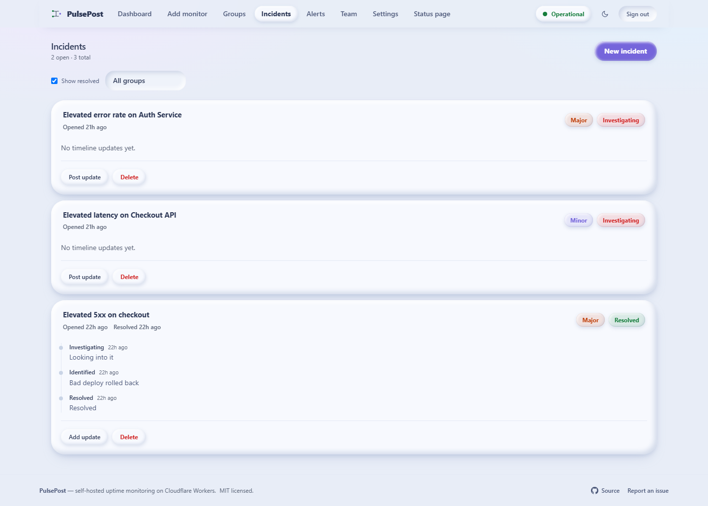
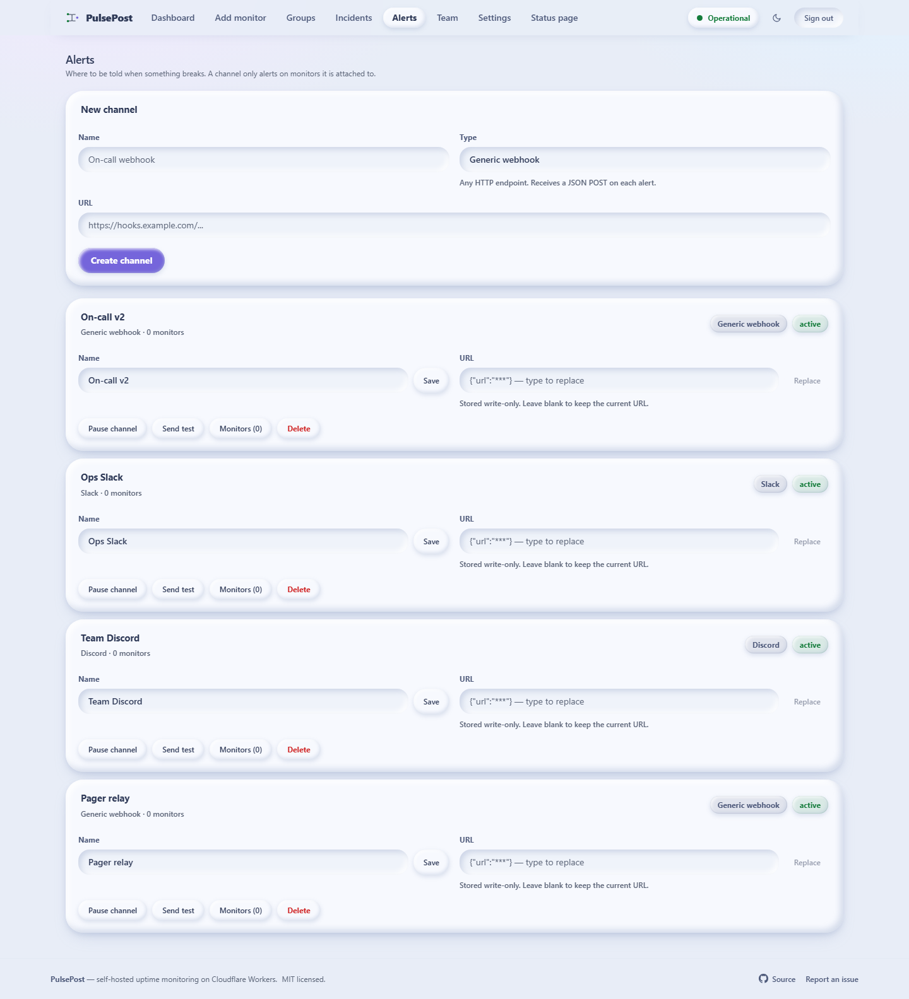
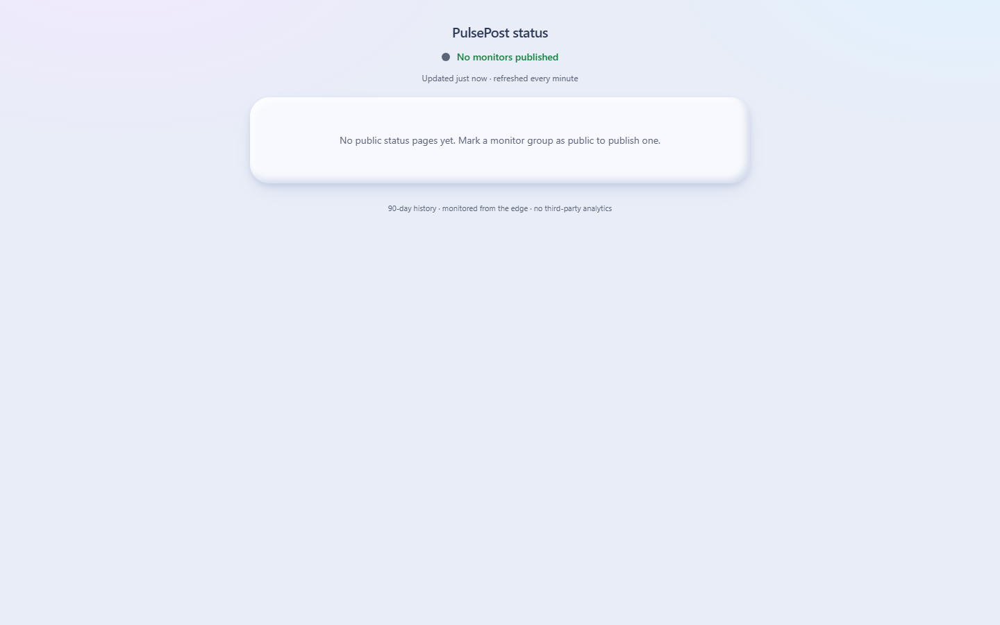

<div align="center">

# PulsePost

**Ek Cloudflare Worker. Poora uptime monitor. Paanch database. Zero vendor lock-in.**

[](#)
[](https://workers.cloudflare.com)
[](#database-provider-badlo)
[](#license)
[](#performance)

[Dashboard](#dashboard) · [Features](#features) · [Quick start](#quick-start) · [Deploy](#deploy) · [Docs](#documentation)

</div>

PulsePost ek self-hosted uptime aur status-page monitor hai jismein **frontend aur
backend ek hi Cloudflare Worker** mein rehte hain — koi alag API host nahi, koi alag
frontend deploy nahi, koi CDN bucket manage nahi karna. Poora project free tier pe
chalta hai, aur database ek env var badalne se kisi bhi doosre provider pe shift ho
jaata hai.

<p align="center">
  
</p>

---

## Dashboard

<p align="center">
  
  
</p>

<p align="center">
  
  
  
</p>

Poore gallery: [`docs/images/`](docs/images/) — har page light aur dark dono me.

---

## Kyun alag hai

| | PulsePost |
|---|---|
| **Deploy unit** | Ek Worker — SPA + API + cron, sab ek |
| **Database** | D1 · Turso · Supabase · Neon · Hyperdrive · local SQLite |
| **Vendor lock-in** | Koi nahi — `DB_PROVIDER` badlo, bas |
| **Telemetry** | Koi nahi. Koi bhi data bahar nahi jaata |
| **Cold start** | Hono + Workers native, ~300 KB gzip |
| **License** | MIT — apne hisaab se self-host karo |

---

## Features

**Monitoring**
- HTTP monitor — koi bhi method, headers, body, expected status range
- Multi-step DSL — `login → token → authenticated call`, 11 assertion operators
- Per-monitor thresholds: latency warn/fail, downtime threshold before alerting
- Cron sweep — least-recently-checked fairness, retries, alert deduplication
- Multi-colo execution — `CHECK_COLOS` se Cloudflare se kai edge locations se check

**Dashboard**
- Live edge map (Leaflet) — har check kis Cloudflare colo se aaya
- Latency charts (Recharts), 90-day uptime bars, per-group rollups
- Server-side search, sort, pagination — list chhoti ho ya badi, same code
- Public status pages — per-group slug se, koi login nahi chahiye
- Light (clay) + dark themes, fully responsive, code-split

**Operations**
- Incidents — timeline updates, auto `resolved_at` derivation
- Notification channels — 13 transports, per-monitor policy (see below)
- Multi-user — admin / editor / viewer roles, TOTP 2FA, PBKDF2 passwords
- Audit log — har destructive action record hota hai

**Security**
- SSRF guard — private/loopback/link-local/CGNAT block, DNS re-resolution, redirect revalidation
- CSP (`script-src 'self'`), HSTS, rate limiting, Zod validation, CORS, IP allowlist
- Webhook URLs **write-only** — store hote hain, kabhi return nahi hote
- Session tokens ke **hash** store hote hain — DB leak se cookie usable nahi banta

---

## Quick start

```bash
git clone https://github.com/SudhirDevOps1/PulsePost.git
cd PulsePost
pnpm install
cp wrangler.toml.example wrangler.toml     # DB_PROVIDER = "d1" rakho
pnpm dev                                  # http://127.0.0.1:8787
```

Pehli baar chalate waqt koi admin account nahi hota. Browser me kholo aur
**onboarding screen** pe pehla admin bana do — uske baad `/api/auth/setup` band
ho jaata hai (409).

Demo data dekhna hai? Dashboard khaali table pe charts, uptime bars aur edge map
sab bekaar dikhte hain:

```bash
node scripts/seed-demo.mjs http://127.0.0.1:8787
# demo@pulsepost.local / demo-Instance-2026!   ← sirf local instance
```

### Offline install

Poori tarah bina internet ke chal sakta hai — pnpm store project ke andar vendored hai:

```bash
pnpm offline:install    # --offline --frozen-lockfile
pnpm offline:check      # verify karta hai ki kya kya missing hai
```

Details [`RUNNING.md`](RUNNING.md) me.

---

## Deploy

Cloudflare pe live karne ke liye domain ki zaroorat nahi — `*.workers.dev` free milta
hai, aur credit card bhi nahi. Poora procedure [`docs/DEPLOYMENT.md`](docs/DEPLOYMENT.md)
me hai (D1 create → `wrangler secret put` → deploy → pehla admin banao).

<details>
<summary>Sabse chhoti command</summary>

```bash
pnpm exec wrangler d1 create pulsepost-db      # database_id wrangler.toml me daalo
pnpm exec wrangler secret put CRON_SECRET      # node -e "console.log(crypto.randomUUID()+crypto.randomUUID())"
pnpm deploy
```

</details>

---

## Database provider badlo

Yahi ek step poori lock-in khatam kar deta hai. `DB_PROVIDER` set karo, baaki
code same rehta hai:

| Provider | `DB_PROVIDER` | Extra setup |
|---|---|---|
| Cloudflare D1 | `d1` | `wrangler d1 create pulsepost-db` |
| Turso (LibSQL) | `turso` | `TURSO_DATABASE_URL`, `TURSO_AUTH_TOKEN` |
| Supabase | `supabase` | `SUPABASE_DATABASE_URL` (pooler URL use karo) |
| Neon | `neon` | `NEON_DATABASE_URL` |
| PostgreSQL | `hyperdrive` | `wrangler hyperdrive create` |
| Local SQLite | `sqlite` | `DATABASE_URL=file:./data/pulsepost.db` |

Schema ek hi file hai — `migrations/0001_init.sql` — jo SQLite aur Postgres
dono pe bina badle chalti hai. Placeholder rewriting aur boolean handling
`src/worker/db/dialect.ts` me hai.

---

## Performance

Cloudflare Workers free tier ki **sabse sakht limit 10 ms CPU per request** hai.
Isi wajah se:

- **Charts aur map lazy-load** hote hain — Recharts ~82 KB aur Leaflet ~45 KB
  gzip, dono first paint se baad me.
- **`daily_status` rollups** — 90/365-day uptime ek table se, ~365 rows ke bajaye
  ~525,600. `include_uptime=1` opt-in hai, warna har list request me 90 numbers ×
  har monitor bajate.
- **`CHECKS_PER_RUN = 20`** — 50 subrequest cap ke andar notification calls ke
  liye headroom chhodkar.
- **Session token ka hash** store hota hai, token nahi — lookup chhota rehta hai.

Total cold payload ~300 KB gzip.

---

## Notification channels

Har alert 13 transports me ja sakti hai. Config write-only hai — store to hota
hai, par API kabhi return nahi karta.

| Transport | Chahiye |
|---|---|
| `webhook` | Koi bhi HTTPS endpoint |
| `slack`, `discord`, `mattermost`, `rocketchat` | Incoming webhook URL |
| `telegram` | Bot token + chat ID |
| `ntfy` | Server URL + topic |
| `gotify` | Server URL + application token |
| `stoat` | Server URL + channel webhook token |
| `pushover` | User key + application token |
| `pushbullet` | Access token |
| `pagerduty` | Events API v2 routing key |
| `opsgenie` | API key (+ optional team) |

**PagerDuty/Opsgenie** stateful hain: ek outage pe ek incident khulta hai, phir
`resolve` hota hai — `dedup_key`/`alias` se, warna ek ghante ka outage 60 alag
incidents bana dega.

Mattermost aur Rocket.Chat Slack-compatible webhooks consume karte hain, isliye
wahi payload builder use karte hain.

> ⚠️ **Format verification:** PagerDuty aur ntfy ke payloads official docs se
> verify kiye gaye. Baaki 11 documented-standard APIs par likhe gaye hain, par
> is environment me unki docs fetch nahi ho payin. Live credentials ke saath
> ek-ek karke test kar lein — har channel ka **Send test** button hai.

---

## Cloudflare D1 usage

Poora audit [`D1-AUDIT.md`](D1-AUDIT.md) me hai. Sabse zaroori baatein:

| Operation | Frequency | Rows Read/Day | Rows Written/Day |
|---|---|---|---|
| Monitoring checks | 5,760/day | ~5,760 | ~5,760 |
| Dashboard loads | 100/day | ~2,400,000 | 0 |
| Status page loads | 500/day | ~250,000 | 0 |
| Cron cleanup | 1/day | ~5,760 | ~5,760 |
| **TOTAL** | | **~2,500,000** | **~11,520** |
| **Free limit** | | **5,000,000** | **100,000** |
| **% used** | | **50%** | **12%** |
| **Verdict** | | ⚠️ Warning | ✅ Safe |

> **D1 rows read pe bill karta hai — bytes ya query count pe nahi.** Ye
> distinction sab kuch decide karta hai. Ek wide scan jo har request pe chalta
> hai, quota ko bina koi error dikhaye khaa deta hai.

### Jo theek kiya

`GET /api/monitors` har call pe 90-din ka uptime **raw `checks` table se scan**
kar raha tha, aur `daily_status` rollup ko sirf tab dekhta tha jab raw scan khaali
aata. Ye ulta tha — rollup ka poora purpose hi ye hai.

Per dashboard load: **~1,280,000 rows → ~24,000** (53× kam).

### Jo jaanbujh kar nahi kiya

| Suggestion | Kyun nahi |
|---|---|
| `SELECT *` hatao | D1 **rows** bill karta hai. Primary-key lookup me 1 row hi padhega. Benefit sirf bandwidth ka, jo bill nahi hota |
| KV caching | Workers KV free tier **1,000 writes/day** hai. 30s polling = 2,880 writes/day — quota turant khatam. Cache API sahi choice hai, wo Phase 5 me hai |
| Cron `0 3 * * *` | Abhi `* * * * *` hai kyunki monitor checks bhi isi cron se chalte hain. Frequency 144× kam karne se monitoring ruk jaayegi |

### Indexes

**Koi naya index nahi banaya** — zaroorat nahi thi. `EXPLAIN QUERY PLAN` se
verified: teeno hot queries already indexed hain (`idx_checks_monitor_time`
covering index ke roop me use hota hai). D1 me har extra index har INSERT pe
write cost badhata hai, aur `checks` me roz ~5,760 inserts hote hain.

### Retention

| Table | Retention | Kyun |
|---|---|---|
| `checks` | 7 din | 1440 rows/monitor/day — isse zyada mehnga |
| `daily_status` | 365 din | 1 row/monitor/day, 90d bars ka source |
| `incidents`, `audit_log` | permanent | Chhote hain, history valuable hai |

---

## Architecture

```
src/
├── worker/           # Backend — ek Hono app
│   ├── routes/       # monitors, groups, incidents, channels, users, auth, status
│   ├── db/           # 6-provider adapter + portable SQL dialect
│   ├── checkers/     # HTTP + DSL engine, SSRF guard, cron sweep
│   ├── notifications/# Slack / Discord / webhook payload builders
│   ├── auth/         # PBKDF2, TOTP, sessions
│   └── middleware/   # security headers, CORS, rate limit, identity
├── shared/           # Types + Zod schemas (dono taraf share hote hain)
└── web/              # React + Vite SPA
```

Database abstraction `src/worker/db/types.ts` me ek interface hai. Naya provider
add karna hai to ek adapter likho, baaki code untouched rehta hai.

---

## Commands

| Command | Kya karta hai |
|---|---|
| `pnpm dev` | Build + local Worker |
| `pnpm build` | Production build |
| `pnpm deploy` | Cloudflare pe deploy |
| `pnpm test` | Test suite (157 tests) |
| `pnpm typecheck` | `tsc --noEmit` |
| `pnpm verify` | Sab kuch — imports, types, tests |
| `pnpm db:migrate` | Migration chalao (non-Worker DBs ke liye) |
| `pnpm offline:prepare` | Offline store banao |
| `node scripts/seed-demo.mjs` | Local demo data bharo |
| `node scripts/shoot.mjs` | Docs screenshots regenerate karo |

---

## Documentation

| File | Kya hai |
|---|---|
| [`docs/DEPLOYMENT.md`](docs/DEPLOYMENT.md) | Cloudflare + doosre providers pe deploy, step by step |
| [`docs/CONFIGURATION.md`](docs/CONFIGURATION.md) | Har env var, har secret, default value ke saath |
| [`docs/API.md`](docs/API.md) | Saare 36 REST endpoints, auth ke saath |
| [`docs/CONTRIBUTING.md`](docs/CONTRIBUTING.md) | Local setup, conventions, PR flow |
| [`D1-AUDIT.md`](D1-AUDIT.md) | D1 usage audit — queries, rows read/written, optimizations |
| [`RUNNING.md`](RUNNING.md) | Troubleshooting, offline install |
| [`ANALYSIS.md`](ANALYSIS.md) | Design decisions aur architecture rationale |
| [`SECURITY.md`](SECURITY.md) | Threat model, disclosure policy |
| [`PROGRESS.md`](PROGRESS.md) | Kya bana, kya bugs mile |

---

## Security

Koi vulnerability mili ho to report karein — public issue ke bajaye
private channel prefer karenge. Details [`SECURITY.md`](SECURITY.md) me.

> **Production pe deploy karne ke baad** pehla admin account bana do aur
> `.dev.vars` / `wrangler.toml` kabhi commit mat karna. Dono gitignore me hain.

---

## Contributing

Issues aur PR welcome hain. Chhote changes pehle `pnpm verify` chala lein.
Details [`docs/CONTRIBUTING.md`](docs/CONTRIBUTING.md) me.

---

## License

MIT — [`LICENSE`](LICENSE)